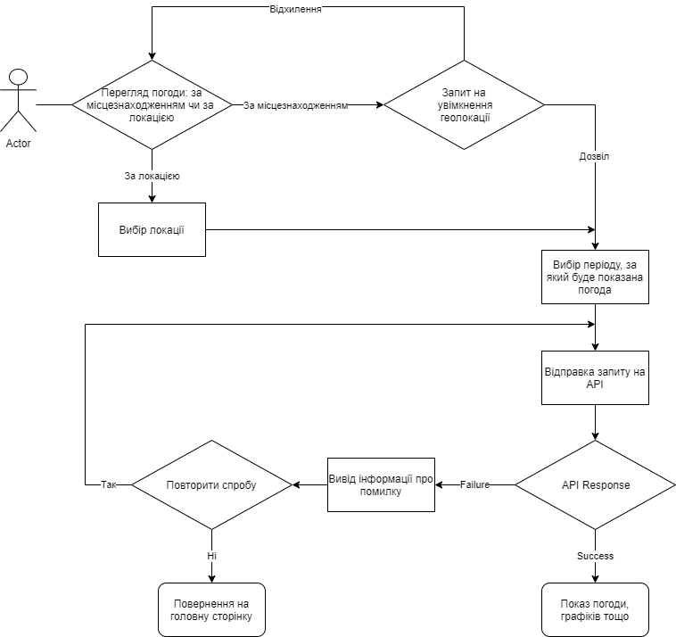
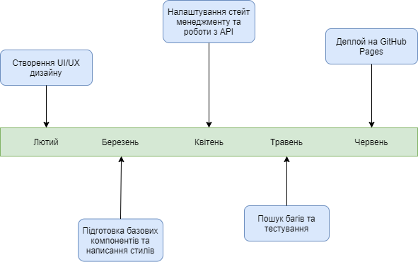

# **Weather App**

## _Опис проекту:_

Проект є веб-додатком, за допомогою якого користувач зможе дізнаватися погоду для різних локацій і часових проміжків. Цікавий інтерфейс і багатий функціонал - ось, що буде приваблювати користувача.

## _Актуальність проекту:_

Перегляд погоди є завжди актуальним, особливо, коли відправляєшся на прогулянку або у подорож. Цей веб-додаток буде відрізнятися від інших простим і зрозумілим для звичайного користувача інтерфейсом, але не поступатиметься дизайном і сучасним функціоналом.

## _Функціонал продукту:_

У користувача є можливість перегляду погоди за своїм місцезнаходженням або, вибравши певну локацію. Буде можливість дивитись погоду похвилинно на годину вперед, або погодинно на два дні вперед, або на кожен день на тиждень вперед. Також можна буде подивитися історію погоди попередніх п'яти днів. Продукт буде містити погодні мапи і графіки(температури, тиску і тд.). Функціонал ще може вдосконалюватись або змінюватись під час розробки.

## _Стек технологій:_

-   React

Я обрав `React`, бо це найкращий варіант для невеликого веб-додатка, який буде швидко працювати за рахунок Virtual DOM, який використовується в цій бібліотеці.

-   TypeScript

Зараз мало використувують `VanillaJS`, бо по мірі розширення веб-додатку все складніше стає відслідковування правильних типів, передача `props`, помилки виникають тільки на етапі компіляції. При використанні `Typescript` ці всі помилки можна побачити ще до компіляції, вони будуть підсвічуватись у вашому редакторі коду і це дуже пришвидшує написання коду та виправленення багів.

-   Redux/Hooks

Redux - зручна бібліотека для управління станом у веб-додатку. Я обрав її, бо вона дозволяє структурувати код і винести state за межі компонентів. Можливо, вона буде лишньою, оскільки мій додаток не буде надто великим. На початку розробки я буду використовувати звичайні хуки, а якщо зрозумію, що мені стає важко керувати стейтом, то використаю Redux для глобальних даних.

-   Redux Thunk/SWR

`Redux Thunk` більше підходить для мене, бо ця технологія набагато простіша, ніж `Saga`, і її повністю вистачить для моїх потреб. `SWR` буду використовувати у тому випадку, якщо зрозумію, що у мене не дуже багато компонентів і мені не потрібен `Redux`, великим плюсом `SWR` є те, що його можна дуже гнучко налаштувати, а також використовувати кешування даних . Обидві бібліотеки дозволяють лекго і зручно працювати з асинхронним кодом у веб-додатку.

-   OpenWeatherMap API

Під час пошуку API для отримання даних про погоду я найшов декілька, які мені здались хорошими. Проте, саме це API є безкоштовним, і дає найбільше інформації про погоду.

-   Styled Components

Це найсучасніший спосіб стилізації компонентів(так званий `css in js`). Він дозволяє позбутися від `.css` файлів і перенести весь код безспосередньо до файлу з компонентом. На перший погляд, це може видатися більш складним, але оскільки у мене є досвід з цією технологією, і я впевенений, що вона дозволяє ще більше і краще використовувати компонентний підхід, то я буду використовувавти саме її.

## _Блок-схема:_

## _Timeline:_

